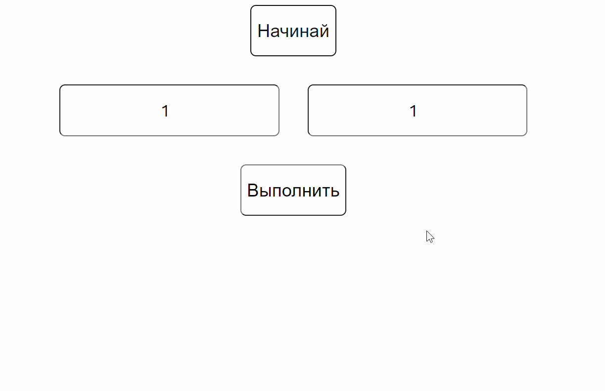

# React-burgers

**React-test-array-sum app** - test application for adding two numbers and adding their sum to an array.

## Running application

https://dmitriev-nikolay.github.io/react-test-array-sum/

## Application information

+ the app is built with create-react-app
+ functional components used
+ for styles used scss, mixins, variables, animation
+ a test function is written for the application to check components using ___**Jest**___ and ___**Enzyme**___

## Installation
___
+ clone this repository to your computer
+ open a project in IDE
+ and:

```javascript
npm install
```

## Usage

```javascript
npm start
```

## Test

```javascript
npm run test
```

## Functional

